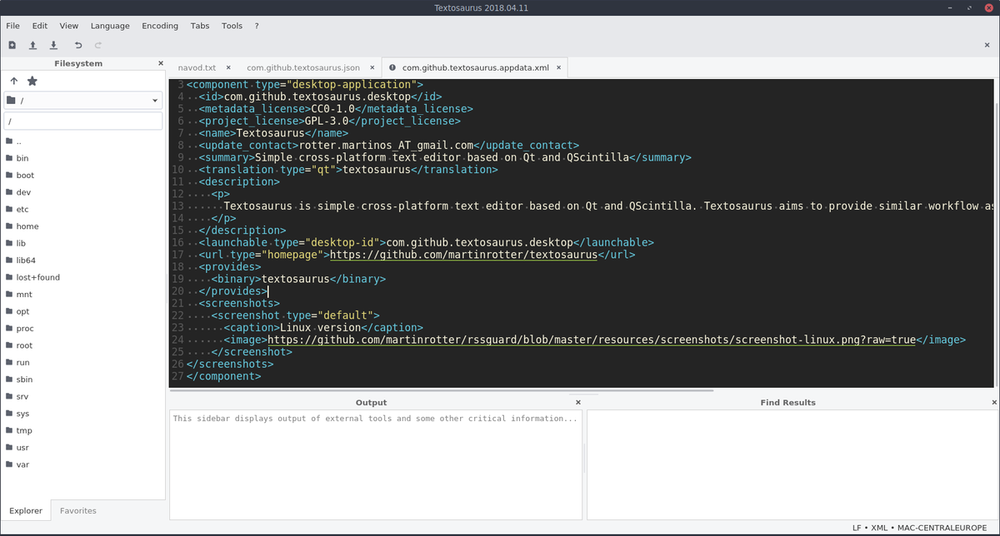

Textosaurus
=============

Textosaurus is simple cross-platform UTF-8 text editor based on Qt and Scintilla. Textosaurus aims to provide similar workflow as [Notepad++](https://notepad-plus-plus.org) does.

You can support author of Textosaurus [here](https://martinrotter.github.io/donate). Textosaurus icon was created by [http://www.fasticon.com](http://www.fasticon.com). Flag icons are provided by [IconDrawer](http://www.icondrawer.com/flag-icons.php).

### [Translations](https://www.transifex.com/martinrotter/textosaurus/dashboard/) are welcomed!!!

Downloads
---------
* [stable releases](https://github.com/martinrotter/textosaurus/releases),
* [development builds](https://github.com/martinrotter/textosaurus/wiki/Development-builds).

How to build
------------
See main [project file](build.pro) for instructions.

Features
--------

* UI:
    - cross-platform look & feel,
    - **configurable toolbar**
    - changeable icon themes and styles,
    - main window remembers its location and size,
    - hideable toolbar and statusbar,
    - main window can stay on top,
    - **tray icon**,
    - can record/save/play **macros**,
    - can **encrypt files with OpenSSL**, see [here](https://github.com/martinrotter/textosaurus/wiki/User-Manual#encryption) for more info,
    - simple interface,
    - **movable dock sidebars**:
        * "Output" sidebar - can display output of external tools and other information,
        * "Character Map" sidebar - displays **ALL non-control characters from Unicode table (not only from BMP)** and allows user to insert them in text editor via mouse double click,
        * "Filesystem" sidebar - allows to browse folder hierarchy and mark some files as favorites,
        * "Markdown Preview" sidebar - allows yout to display simple preview of your Markdown scripts,
    - tabbed interface.
* Text editor component:
    - **supports a lot of input encodings**,
    - automagic recognition of input file type via `file` utility (if available),
    - input file encoding detection (via bundled [uchardet](https://www.freedesktop.org/wiki/Software/uchardet/)),
    - switchable encoding for each separate document,
    - **uses full UTF-8 internally**,
    - auto-indent with mixed TAB/SPACES support,
    - multiple cursor editing and multiple selections, including rectangular selections,
    - can load relatively big files (100 MB file should not be a problem),
    - can **print files including syntax highlighting**,
    - can print to PDF,
    - **code folding**,
    - hideable line numbers,
    - **configurable color schemes**,
    - URL highlights (fast on big files, only currently visible lines),
    - highlights occurrences of current selection (fast on big files, only currently visible lines),
    - switchable indent characters (spaces/tabs),
    - adjustable tab/indent width,
    - adjustable vertical line height (responds to `SHIFT+WHEEL UP/DOWN` shortcut too),
    - adjustable editor font (size can be changed also via `CTRL+WHEEL UP/DOWN` shortcut),
    - can display **ligatures** (tested with Fira Code on GNU/Linux and Windows),
    - simple find/replace functionality, which allows you to:
        * search forward/backward for plain string or regular expression (ECMAScript),
        * display number of occurrences of search phrase in a document,
        * replace all occurrences,
        * display results via "Find Results" sidebar,
    - switchable EOL mode for new documents,
    - EOL mode auto-detection,
    - **syntax highlighting** for many text formats,
	- inituitive filtering for menu of available syntax highlighters,
    - conversion of existing EOLs,
	- switchable visibility of EOL/whitespace characters,
    - support for **many text operations**, which allow you to:
        * upload selection/document to pastebin sites,
        * convert to/from Base64 and Base64Url,
        * convert to/from URL encoded text,
        * convert to HTML escaped text, 
        * insert current date/time,
	- support for **external scripts**, which allow you to:
	    * pass current selection/line/document/file to your script,
		* run your script with arbitrary interpreter (Python, Bash or some other executable),
		* get output of your script (as new file, replace selection/document, copy to clipboard, ...),
		* **settings of external tools is completely portable** (*).
* Misc:
    - cross-platform easy-to-use **plugin API**,
    - can **save/restore session** in platform independent way,
    - **all user data (settings, external tools definitions, ...) are fully portable** (You can use the same user data shared via Dropbox on all supported platforms.),
    - depends only on Qt (Scintilla is bundled),
    - relatively lightweight,
    - no JavaScript components, no bundled Chromium, no Electron, no web technologies inside,
    - always OSS.

\* Usually, custom external tools are executed via Bash or Python, so you must have used interpreter available in all environments where Textosaurus is used. On Windows, Cygwin is probably the best way to use these.
